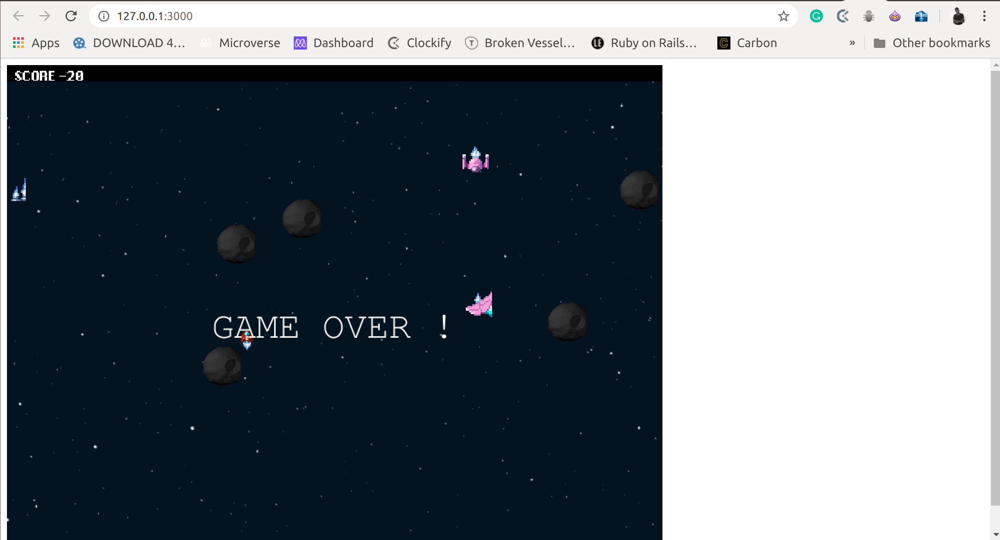

# The Expanse

> A simple rpg game built using javascript and the game engine phaser, it follows the popular TV series the expanse.

## Live Demo

[Live Demo](https://the-shooter-2020.herokuapp.com/)

Additional description about the project and its features.

## Built With

- Javascript,
- Phaser

## Getting Started

To get a local copy up and running follow these simple example steps.

### Prerequisites
- A running Server

### Setup
- Clone the repository using `git clone`
- Extract the clone and place it in the webroot of your server
- Start your server
- Go to your browser and type `localhost` plus the port asigned to you eg `localhost:8080`
- Start playing the game

### Usage
- Click the play game button to play the game
- The game has objectives that should be met

### Game Objectives
- Use the space bar to shoot at enemy ships, and earn points
- Collision with enemy ships will see you lose points
- Collision with moving asteroids will lead to end of game
- Shooting at the asteroids only moves it away but does not destroy it

## Author

👤 **Leonard Rwai Kanyesigye**

- Github: [@rmauritsson](https://github.com/rmauritsson)
- Twitter: [@leokanye](https://twitter.com/leokanye)

## 🤝 Contributing

Contributions, issues and feature requests are welcome!

Feel free to check the [issues page](issues/).

## Show your support

Give a ⭐️ if you like this project!

##Inspiration

The game objectives, design were inspired by the TV series the expanse

## Acknowledgments

- Freecode Camp
- Luis Zano articles
- Phaser documentation
- openmargart

## 📝 License

This project is [MIT](lic.url) licensed.
